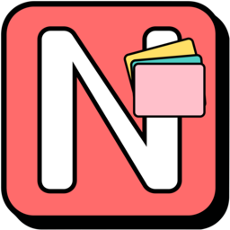
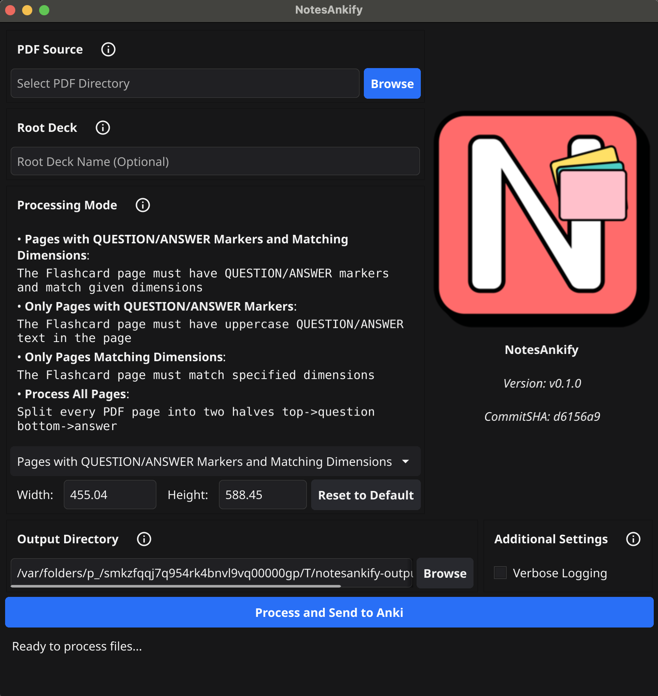
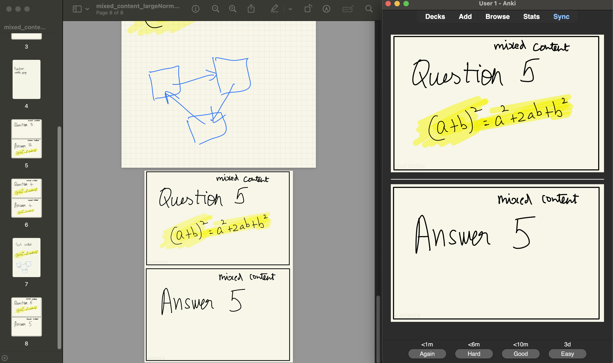
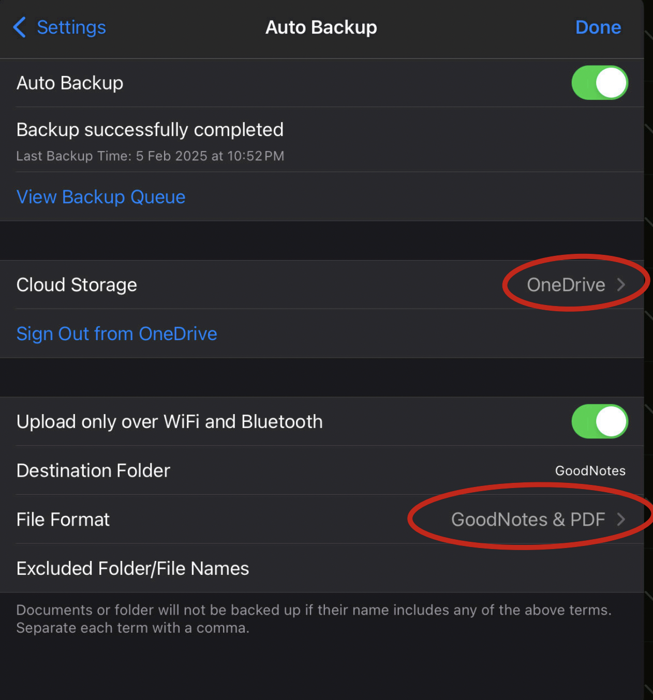
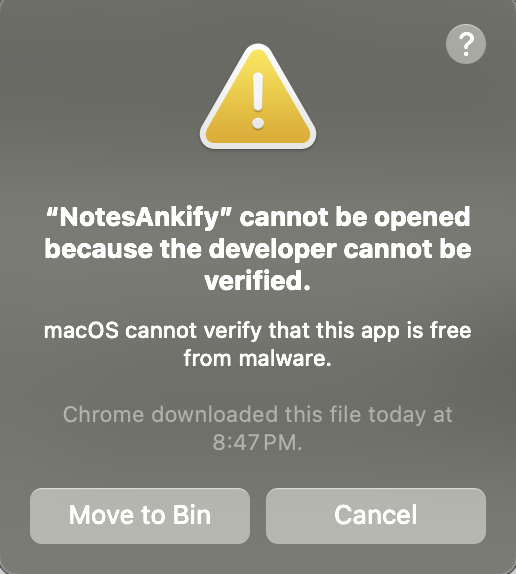
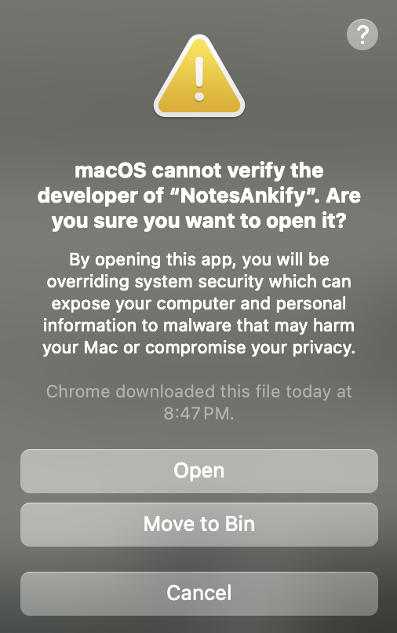
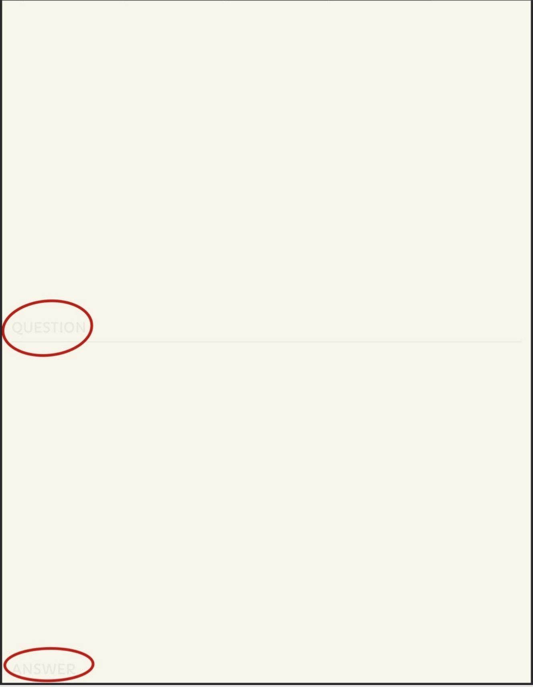
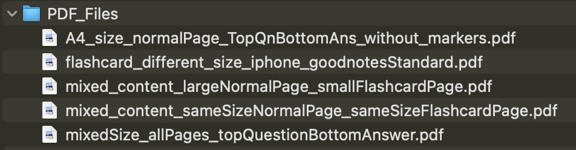
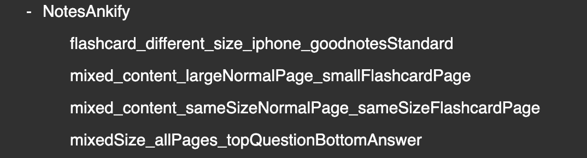

  

## NotesAnkify Documentation

Turn your PDF notes into Anki flashcards automatically. Study smarter with spaced repetition!

## Table of Contents
- [Why NotesAnkify?](#why-notesankify)
- [Quick Start](#quick-start)
- [Installation](#installation)
    - [Windows](#windows)
    - [macOS](#macos)
    - [Linux](#linux)
- [Creating Flashcards](#creating-flashcards)
    - [Using Question/Answer Markers](#1-using-questionanswer-markers)
    - [Using Standard Dimensions](#2-using-standard-dimensions)
    - [Simple Top/Bottom Split](#3-simple-topbottom-split)
- [Processing Modes](#processing-modes)
    - [Markers + Dimensions Mode](#1-markers--dimensions-mode-most-strict)
    - [Markers Only Mode](#2-markers-only-mode-flexible-size)
    - [Dimensions Only Mode](#3-dimensions-only-mode-standard-size)
    - [Process All Pages Mode](#4-process-all-pages-mode-most-flexible)
- [Deck Organization](#deck-organization)
- [Advanced Features](#advanced-features)
    - [Duplicate Detection & Smart Updating](#duplicate-detection--smart-updating)
    - [Output Directory](#output-directory)
    - [Processing Report](#processing-report)
- [Troubleshooting](#troubleshooting)
    - [Common Issues](#common-issues)
    - [Finding Log Files](#finding-log-files)
- [FAQ](#faq)
- [Need Help?](#need-help)

## Why NotesAnkify?

Taking notes and creating flashcards are essential for effective studying, but maintaining them separately is time-consuming. 
NotesAnkify bridges this gap by:

- Converting your PDF note pages directly into Anki flashcards
- Preserving your existing note-taking workflow
- Supporting multiple note formats and apps
- Preventing duplicate flashcards automatically

## My Setup

- GoodNotes for notes. Although, NotesAnkify will work with any app as long as the notes(with flashcards) are available as pdf files.
- Add flashcards with the in-built flashcard template(Goodnotes Standard Size Flashcard) along with regular note pages.
- Automatic Backup to OneDrive. (GoodNotes and PDF)
  
- Download backup folder with all notes and pdf files.
- Run NotesAnkify on this downloaded folder to extract all flashcards and send it to Anki.
- Duplicates will only be processed once!

## Quick Start

1. **Install Prerequisites**
    - Download [Anki Desktop](https://apps.ankiweb.net/)
    - Install [AnkiConnect](https://ankiweb.net/shared/info/2055492159) add-on
    - Download NotesAnkify for your platform (See [Installation Guide](#installation))

2. **Format Your Notes**  
NotesAnkify will work as long as the notes are PDF Files.  
Based on how the flashcards are made, we can choose any of these processing methods:

- Pages with QUESTION/ANSWER markers AND matching dimensions:  
This mode will scan through all PDF files for pages that have markers as shown below, 
and also matching the given dimensions (default 455.04 × 587.52). The top half will be set as question card and the bottom
half will become answer card in Anki deck.
         
- Only pages with QUESTION/ANSWER markers:  
This mode will scan all files and extract pages of any 
dimension as long as it has the term "QUESTION" on the top and "ANSWER" at the bottom.
- Only Pages Matching Dimensions:  
This mode will work on any page as long as the dimensions match the input.
The page will be cut in half, top -> Question card, bottom -> Answer card
- Process All Pages:  
Split every PDF page into two halves, top -> Question card, bottom -> Answer card.

3. **Convert to Flashcards**
    - Start Anki
    - Launch NotesAnkify
    - Select PDF directory
    - Specify Root Deck Name (All flashcards will go under this deck name in Anki)
    - Choose processing mode
    - Click "Process and Send to Anki"

## Installation

### Windows

We haven't setup a developer account with Windows yet, so the app might trigger an alert saying it's unverified and dangerous.
If you're not comfortable downloading this, you could also checkout the Github page and build the app yourself locally or download the app from Github packages.
  
Steps:  

1. Download the ZIP file for your system (AMD64/ARM64)
2. Extract the ZIP file to your desired location
3. When you try to run an unverified app, Windows SmartScreen will show a warning message to protect you from potentially harmful software.  
   Here are the exact steps to proceed with installation:  
   When you first try to run the unverified app's installer or executable, you'll likely see a blue window with the message "Windows protected your PC" and "Windows SmartScreen prevented an unrecognized app from starting. Running this app might put your PC at risk."
   To proceed:
   - Click on "More info" in this blue warning window 
   - After clicking "More info," a new button will appear that says "Run anyway"
   - Click "Run anyway" to proceed with the installation 
   - If you encounter a User Account Control (UAC) prompt next (a window asking "Do you want to allow this app to make changes to your device?"):
   - Verify that the publisher name matches what you expect 
   - Click "Yes" to continue the installation 
   - Note: It's important to understand that Windows shows these warnings because unverified apps haven't been signed with a certificate from a trusted developer. Only proceed with installation if you trust the source of the app and have downloaded it from the developer's official website. Think of it like checking ID at a security checkpoint – Windows is simply asking you to vouch for the app's trustworthiness.
4. Run NotesAnkify.exe

### macOS  

We haven't setup a developer account with Apple yet, so the app might trigger an alert saying it's unverified and dangerous.
If you're not comfortable downloading this, you could also checkout the Github page and build the app yourself locally or download the app from Github packages.
  
Steps to Download:  

1. Download the DMG file
2. Open the DMG file
3. Drag NotesAnkify to your Applications folder
4. First, try to open the app normally by double-clicking it. You'll see a message saying the app 
   "cannot be opened because it is from an unidentified developer." At this point, clicking "Cancel" will just close the message.
   

   Instead, right-click (or Control+click) on the app in Finder and select "Open" from the menu.
   This time, you'll see a similar warning message, but it will include an "Open" button. 
   When you open the app this way, macOS remembers your choice and won't show the warning again for this specific app.
   If you don't see the "Open" option, you can also adjust your security settings:  
   Open System Settings (or System Preferences in older versions),  
   Go to "Privacy & Security",  
   Look for the message about the blocked app under "Security",  
   Click "Open Anyway"  
   

Note: It's worth understanding that Apple includes these safeguards because unverified apps could potentially contain malware or other security risks. Before installing any unverified app, make sure you trust its source and have downloaded it from the developer's official website.

### Linux
1. Download the tar.xz file 
2. Extract using: `tar xf NotesAnkify-linux-*.tar.xz`
3. Run the NotesAnkify executable.

## Creating Flashcards

You can create flashcards in three ways:

### 1. Using Question/Answer Markers

Add "QUESTION" and "ANSWER" text to your notes:

### 2. Using Standard Dimensions

Create pages with these exact dimensions:
- Width: 455.04 points
- Height: 587.52 points
- Question on top half
- Answer on bottom half

// INSERT IMAGE - Template showing standard dimensions with measurements labeled

### 3. Simple Top/Bottom Split

Any page can be split into:
- Top half → Question
- Bottom half → Answer

// INSERT IMAGE - Example of a regular page split into question (top) and answer (bottom)

## Processing Modes

NotesAnkify offers four ways to process your notes:

### 1. Markers + Dimensions Mode (Most Strict)
- Requires QUESTION/ANSWER markers
- Must match standard dimensions
- Best for consistent flashcard creation
- Perfect when using templates

### 2. Markers Only Mode (Flexible Size)
- Only checks for QUESTION/ANSWER markers
- Any page size accepted
- Good for mixed-size documents
- Best when you can't control page size

### 3. Dimensions Only Mode (Standard Size)
- Only checks page dimensions
- Splits page into top/bottom
- No markers needed
- Ideal for template-based notes

### 4. Process All Pages Mode (Most Flexible)
- Processes every page
- Splits each page in half
- No formatting requirements
- Quick conversion for simple notes

// INSERT IMAGE - Side-by-side comparison showing example pages that work with each mode

## Deck Organization

Your PDFs are organized into Anki decks following your folder structure:

PDF Source Directory: `PDF_Files`

Root Deck: `NotesAnkify`

Resulting Anki Deck Structure: 

## Advanced Features

### Duplicate Detection & Smart Updating

NotesAnkify uses a technique called "hashing" to manage flashcards intelligently. Think of a hash as a unique fingerprint for each flashcard - even a tiny change will create a different fingerprint.

// INSERT IMAGE - Visual showing how changing content creates different hashes. Example: Two similar flashcards with one small difference, showing different hash values

#### How it Works
1. When a flashcard is processed, NotesAnkify looks at every pixel in the image
2. It combines all the color values into a unique string of characters (the hash)
3. This hash is stored with the flashcard in Anki
4. When processing PDFs again:
    - Same content = Same hash = Skip (prevent duplicate)
    - Changed content = New hash = Add card

#### Benefits
- You can keep flashcards in multiple PDFs without duplicates
- Modified flashcards are automatically updated
- Original cards are preserved if content hasn't changed
- You don't need to track which cards you've already converted

// INSERT IMAGE - Flowchart showing how the same card in multiple PDFs only creates one Anki card

#### Example
Imagine you have the same flashcard in two places:
1. Your chapter notes
2. Your exam review guide

NotesAnkify will:
- Recognize they're the same card
- Only create it once in Anki

### Output Directory
Save processed flashcard images to:
- Review conversion results
- Debug any issues
- Keep a backup of generated cards

### Processing Report
After conversion, you'll see:
- Total PDFs processed
- Number of flashcards created
- Processing time
- Log file location

## Troubleshooting

### Common Issues

#### Cannot Connect to Anki
1. Ensure Anki is running
2. Verify AnkiConnect is installed
3. Restart Anki and try again

#### No Flashcards Created
1. Check PDF formatting 
2. Verify chosen processing mode 
3. Review processing report

#### Access Denied Errors
1. Run as administrator (Windows)
2. Check folder permissions 
3. Verify write access to output directory

### Finding Log Files

Logs are saved in:
- Windows: `%USERPROFILE%\notesankify-logs\`
- macOS: `~/notesankify-logs/`
- Linux: `~/notesankify-logs/`

Include these logs when reporting issues.

## FAQ

**Q: Does it work with handwritten notes?**  
A: Yes! NotesAnkify works with any PDF content, including handwritten notes, typed text, or diagrams.

**Q: Will my existing Anki flashcards be affected?**  
A: No. NotesAnkify safely adds new flashcards without modifying existing ones.

**Q: What note-taking apps are supported?**  
A: Any app that can export to PDF works, including:
- GoodNotes
- Notability
- OneNote
- Nebo
- Any PDF-capable app

## Need Help?

- [Read the Documentation](https://notesankify.com/docs)
- [Report an Issue](https://github.com/kpauljoseph/notesankify/issues)
- [Join Discussions](https://github.com/kpauljoseph/notesankify/discussions)
- [Check the Wiki](https://github.com/kpauljoseph/notesankify/wiki)