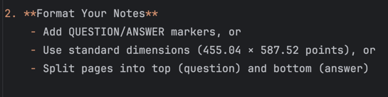

# NotesAnkify Documentation

Convert your PDF notes to Anki flashcards automatically. This tool monitors a directory for PDFs containing flashcards, processes them based on specified page dimensions, and creates/updates Anki decks while maintaining learning progress.

## Quick Start Guide

1. **Install Prerequisites**
    - Download [Anki Desktop](https://apps.ankiweb.net/)
    - Install [AnkiConnect](https://ankiweb.net/shared/info/2055492159) add-on
    - Download NotesAnkify for your platform

2. **Format Your Notes**
    - Add QUESTION/ANSWER markers, or
    - Use standard dimensions (455.04 × 587.52 points), or
    - Split pages into top (question) and bottom (answer)

3. **Convert to Flashcards**
    - Start Anki
    - Launch NotesAnkify
    - Select PDF directory
    - Choose processing mode
    - Click "Process and Send to Anki"

## Processing Modes

### 1. Markers + Dimensions Mode
- **Requirements**:
    - QUESTION/ANSWER markers
    - Standard dimensions
- **Best for**: Consistent, precise flashcard creation
- **Use when**: Using GoodNotes templates

### 2. Markers Only Mode
- **Requirements**: Only QUESTION/ANSWER markers
- **Best for**: Mixed page sizes
- **Use when**: Taking notes in different formats

### 3. Dimensions Only Mode
- **Requirements**: Standard flashcard dimensions
- **Best for**: Template-based notes
- **Use when**: Using consistent templates without markers

### 4. Process All Pages Mode
- **Requirements**: None
- **Best for**: Quick conversions
- **Use when**: Pages are already in question/answer format

## File Preparation

### Using Markers

QUESTION
What is photosynthesis?
ANSWER
Process where plants convert...

### Using Standard Dimensions
- Width: 455.04 points
- Height: 587.52 points
- Question on top half
- Answer on bottom half

## Deck Organization

PDFs are organized into Anki decks following your folder structure:
PDFs/
└── Biology/
├── Chapter1.pdf
└── Chapter2.pdf
└── Chemistry/
└── Notes.pdf
Results in:

Biology::Chapter1
Biology::Chapter2
Chemistry::Notes

## Common Issues

### Connection Issues
- Error: "Could not connect to Anki"
    1. Ensure Anki is running
    2. Check if AnkiConnect is installed
    3. Restart Anki and try again

### Processing Issues
- No flashcards created?
    1. Verify PDF formatting
    2. Check chosen processing mode
    3. Review processing report

### Permission Issues
- Access Denied Errors?
    1. Run as administrator (Windows)
    2. Check folder permissions
    3. Verify write access to output directory

## Frequently Asked Questions

### Can I modify cards after they're created?
Yes, you can edit any flashcard directly in Anki after creation.

### Will my cards sync to AnkiWeb?
Yes, cards will sync normally through Anki's built-in synchronization.

### Does it work with handwritten notes?
Yes, NotesAnkify works with any PDF content, including handwritten notes, typed text, or diagrams.

### What note-taking apps are supported?
- GoodNotes
- Notability
- OneNote (exported as PDF)
- Any app that can export to PDF

## Advanced Features

### Output Directory
- Save processed flashcard images
- Review conversion results
- Debug processing issues

### Duplicate Detection
- Automatic hash generation
- Checks existing cards
- Prevents duplicates

### Processing Report
- Total PDFs processed
- Flashcards created
- Processing time
- Log file location

## Need Help?

- [Create an Issue](https://github.com/kpauljoseph/notesankify/issues)
- [Join Discussions](https://github.com/kpauljoseph/notesankify/discussions)
- Check the [Wiki](https://github.com/kpauljoseph/notesankify/wiki)